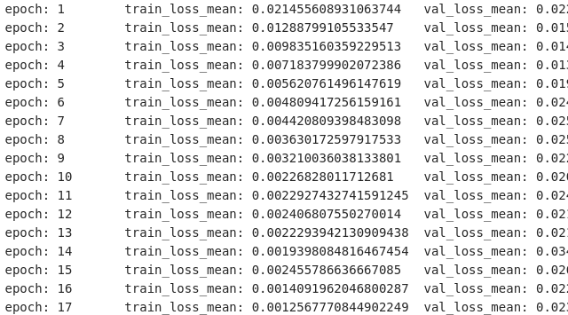

# Homework4PaddleAIStudio
【AI达人创造营第二期】基于ConvNeXt的矿石种类识别


# 基于ConvNeXt的矿石种类识别


## 一、项目背景

### 1.1、飞桨介绍

​		飞桨（PaddlePaddle）以百度多年的深度学习技术研究和业务应用为基础，集深度学习核心训练和推理框架、基础模型库、端到端开发套件、丰富的工具组件于一体，是中国首个自主研发、功能完备、开源开放的产业级深度学习平台。

​		IDC发布的2021年上半年深度学习框架平台市场份额报告显示，百度跃居中国深度学习平台市场综合份额第一。百度飞桨汇聚开发者数量达370万，服务 14 万企事业单位，产生了42.5 万个模型。  飞桨助力开发者快速实现AI想法，高效上线AI业务，帮助越来越多的行业完成AI赋能，实现产业智能化升级。


### 1.2、矿石种类识别项目介绍		

石头，一般指由大岩体遇外力而脱落下来的小型岩体，多依附于大岩体表面，一般成块状或椭圆形，外表有的粗糙，有的光滑，质地坚固、脆硬。可用来制造石器，采集石矿。在几千年前，我们的祖先就是用石头来生火。石头一般由碳酸钙和二氧化硅组成。不同种类的石头具有不同的作用，可以分析出石头的种类，发挥其对应的价值。


​		将NLP领域的Transformer应用在CV领域便开始大放异彩，越来越多的研究人员开始拥入Transformer的怀抱。近阶段的CV研究领域的进展都与Transformer相关，作为CV界的领导者卷积极结构似乎受到了冷漠。突然，一篇名为 [A ConvNet for the 2020s](https://arxiv.org/abs/2201.03545) 的文章为卷积结构神经网络再次明正名。使用ImageNet数据集进行训练，模型拥有相同计算量下，ConvNeXt模型比Swin Transformer有更高的准确率。


## 二、数据介绍

​		数据源于百度飞桨的AI Studio的公开数据集，石头数据集包括各式各样的石头 “玄武岩”、“花岗岩”、“大理石”、“石英岩”、“煤”、“石灰石”、“砂岩” 共计7类。

数据集的地址链接 [石头数据集](https://aistudio.baidu.com/aistudio/datasetdetail/85829)


## 三、模型介绍

​		ConvNeXt的作者的基于ResNet-50出发，和Swin Transformer进行比较，得到以下的实验：

.png)

可以说“基本上没什么创新点“，主要是将Transformer上使用到的技巧运用到该模型上，例如将3x3大小的卷积核换成 7x7的、将少模型的池化层归一化层、激活函数由Relu换为Gelu等。模型结构如下图所示：


## 四、程序实现

引入Paddle、初始化参数

```python
import paddle
import paddle.nn as nn
import paddle.nn.functional as F

trunc_normal_ = nn.initializer.TruncatedNormal(std=0.02)
zeros_ = nn.initializer.Constant(value=0.0)
ones_ = nn.initializer.Constant(value=1.0)
```

构建模型

```python
class ConvNeXt(nn.Layer):

    def __init__(self, in_chans=3, num_classes=1000,
                 depths=[3, 3, 9, 3], dims=[96, 192, 384, 768], drop_path_rate=0.,
                 layer_scale_init_value=1e-6, head_init_scale=1.,
                 ):
        super().__init__()

        self.downsample_layers = nn.LayerList()  # stem and 3 intermediate downsampling conv layers
        stem = nn.Sequential(
            nn.Conv2D(in_chans, dims[0], kernel_size=4, stride=4),
            LayerNorm(dims[0], epsilon=1e-6, data_format="channels_first")
        )
        self.downsample_layers.append(stem)
        for i in range(3):
            downsample_layer = nn.Sequential(
                LayerNorm(dims[i], epsilon=1e-6, data_format="channels_first"),
                nn.Conv2D(dims[i], dims[i + 1], kernel_size=2, stride=2),
            )
            self.downsample_layers.append(downsample_layer)

        self.stages = nn.LayerList()  # 4 feature resolution stages, each consisting of multiple residual blocks
        dp_rates = [x.item() for x in paddle.linspace(0, drop_path_rate, sum(depths))]
        cur = 0
        for i in range(4):
            stage = nn.Sequential(
                *[Block(dim=dims[i], drop_path=dp_rates[cur + j],
                        layer_scale_init_value=layer_scale_init_value) for j in range(depths[i])]
            )
            self.stages.append(stage)
            cur += depths[i]

        self.norm = nn.LayerNorm(dims[-1], epsilon=1e-6)  # final norm layer
        self.head = nn.Linear(dims[-1], num_classes)

        self.apply(self._init_weights)
        self.head.weight.set_value(self.head.weight * head_init_scale)
        self.head.bias.set_value(self.head.bias * head_init_scale)

    def _init_weights(self, m):
        if isinstance(m, (nn.Conv2D, nn.Linear)):
            trunc_normal_(m.weight)
            zeros_(m.bias)

    def forward_features(self, x):
        for i in range(4):
            x = self.downsample_layers[i](x)
            x = self.stages[i](x)
        return self.norm(x.mean([-2, -1]))  # global average pooling, (N, C, H, W) -> (N, C)

    def forward(self, x):
        x = self.forward_features(x)
        x = self.head(x)
        return x
```

模型训练及相应的参数配置

```python
	train_dir = r"Rock_Classification_Dataset/train"
    valid_dir = r"Rock_Classification_Dataset/valid"
    lr_schedule = 0.001

    transform = transforms.Compose([transforms.Resize(size=(224, 224)),
                                    transforms.ToTensor(),
                                    transforms.Normalize(mean=[0.52563523, 0.55325405, 0.59199389],
                                                         std=[0.21688389, 0.20846758, 0.20908272])])

    train_dataset = MyImageNetDataset(root=train_dir, transform=transform)
    valid_dataset = MyImageNetDataset(root=valid_dir, transform=transform)

    loss_function = paddle.nn.CrossEntropyLoss(reduction='mean')

    model = ConvNeXt(num_classes=7)
    optimize = paddle.optimizer.Adam(learning_rate=lr_schedule, parameters=model.parameters())
    train(model=model,
          train_dataset=train_dataset,
          valid_dataset=valid_dataset,
          optimize=optimize,
          loss_function=loss_function)
```

训练模型保存

```python
		accuracy = np.array(accuracy).mean()
        if accuracy > accuracy4best:
            state_dict = model.state_dict()
            paddle.save(state_dict, path.join(save_path, "best.pdparams"))
            accuracy4best = accuracy
```

训练过程展示



## 五、模型评估

TODO

## 六、项目总结

TODO

## 七、个人总结

TODO

## 提交链接

aistudio链接：[基于ConvNeXt的矿石种类识别](https://aistudio.baidu.com/aistudio/projectdetail/3500132)

github链接：[Homework4PaddleAIStudio](https://github.com/YaoTaoQiHua/Homework4PaddleAIStudio)

gitee链接：[基于ConvNeXt的矿石种类识别]()
